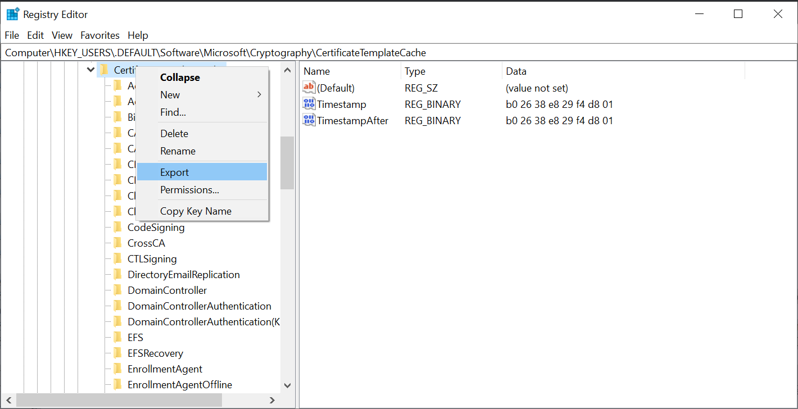

# regcertipy
Parses cached certificate templates from a Windows Registry `.reg` file and 
displays them in the same style as 
[Certipy](https://github.com/ly4k/Certipy) does.

## Getting started
We prefer using the [uv package manager](https://docs.astral.sh/uv/), as it 
will automatically create a virtual environment for you. Alternatively, you 
can use `pip install regcertipy` within any other Python environment that 
you manage.

```
$ uv venv
$ source .venv/bin/activate
$ uv pip install regcertipy
$ regcertipy -h
usage: regcertipy [-h] [-s SID_FILE] [-text] [-stdout] [-json] [-csv]
                  [-output prefix] [--neo4j-user NEO4J_USER]
                  [--neo4j-pass NEO4J_PASS] [--neo4j-host NEO4J_HOST]
                  [--neo4j-port NEO4J_PORT]
                  regfile

Regfile ingestor for Certipy

positional arguments:
  regfile               Path to the .reg file.

options:
  -h, --help            show this help message and exit
  -s SID_FILE, --sid-file SID_FILE
                        File containing the user's SIDs

output options:
  -text                 Output result as formatted text file
  -stdout               Output result as text directly to console
  -json                 Output result as JSON
  -csv                  Output result as CSV
  -output prefix        Filename prefix for writing results to

BloodHound:
  --neo4j-user NEO4J_USER
                        Username for neo4j
  --neo4j-pass NEO4J_PASS
                        Password for neo4j
  --neo4j-host NEO4J_HOST
                        Host for neo4j
  --neo4j-port NEO4J_PORT
                        Port for neo4j
```

Use regedit.exe to export the keys under 
`HKEY_USERS\.DEFAULT\Software\ Microsoft\Cryptography\CertificateTemplateCache\`. 
Then, the .reg file can be fed into regcertipy with: regcertipy <regfile>.



### SIDs

Because `regcertipy` is intended for offline usage, SIDs cannot be dynamically resolved. Therefore, `regcertipy` includes a couple of options that can be used for offline SID information.

Firstly, the `--sid-file` flag can be used to provide a list of SIDs that the user is a member of. This list can be obtained from BloodHound or other tools.

Secondly, `regcertipy` can use a `neo4j` connection to dynamically resolve SIDs using BloodHound's database. For this, install the `neo4j` dependency using:

```
uv pip install --group bloodhound
```

## Development
Note that we use the [Black code formatter](https://black.readthedocs.io/en/stable/) 
for code formatting. Moreover, we use the Git Flow branching model, meaning 
that we actively develop on the "develop" branch, and merge to the "main" 
branch (& tag it) when a new release is made, making the "main" branch the 
production branch.

```
$ uv sync --dev # Also installs the Black code formatter.
$ uv run black . # To format the current code base.
$ uv run regcertipy -h
usage: regcertipy [-h] [-s SID_FILE] [-text] [-stdout] [-json] [-csv]
                  [-output prefix] [--neo4j-user NEO4J_USER]
                  [--neo4j-pass NEO4J_PASS] [--neo4j-host NEO4J_HOST]
                  [--neo4j-port NEO4J_PORT]
                  regfile

Regfile ingestor for Certipy

positional arguments:
  regfile               Path to the .reg file.

options:
  -h, --help            show this help message and exit
  -s SID_FILE, --sid-file SID_FILE
                        File containing the user's SIDs

output options:
  -text                 Output result as formatted text file
  -stdout               Output result as text directly to console
  -json                 Output result as JSON
  -csv                  Output result as CSV
  -output prefix        Filename prefix for writing results to

BloodHound:
  --neo4j-user NEO4J_USER
                        Username for neo4j
  --neo4j-pass NEO4J_PASS
                        Password for neo4j
  --neo4j-host NEO4J_HOST
                        Host for neo4j
  --neo4j-port NEO4J_PORT
                        Port for neo4j
```

You can also run the `__init__.py` or `__main.py__` Python file in your 
favourite debugger.
